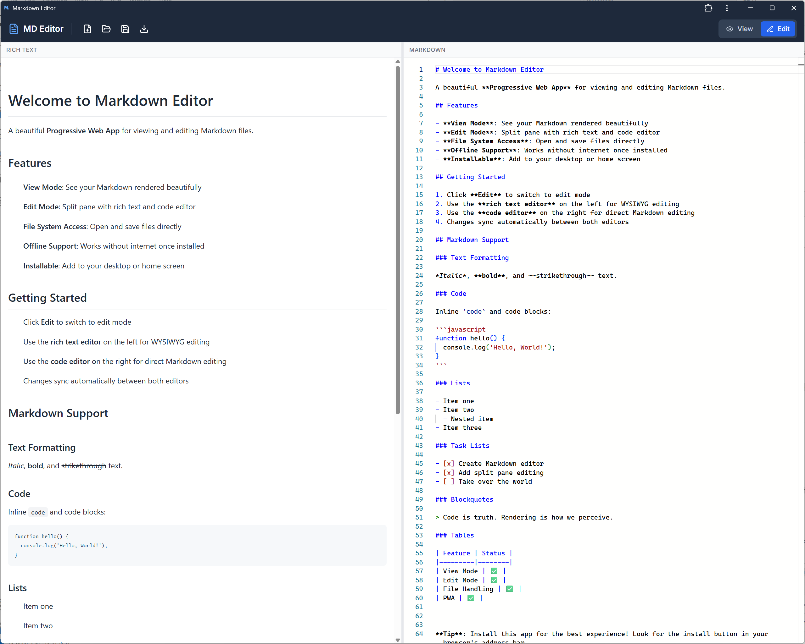

# Markdown Editor

A fast, offline-capable Progressive Web App for viewing and editing Markdown files. Features a unique split-pane editor with synchronized WYSIWYG and code views.

**[Try it live](https://md.woodmantech.com)** | **[Support this project](https://ko-fi.com/YOUR_KOFI_USERNAME)**



## Features

- **View Mode** - Beautiful rendered Markdown with GitHub-flavored styling
- **Edit Mode** - Split-pane with WYSIWYG editor (left) and code editor (right)
- **Bidirectional Sync** - Edit in either pane; changes sync instantly
- **Native File Access** - Open and save files directly (Chrome/Edge) with fallback for other browsers
- **Offline Support** - Full functionality without internet connection
- **Installable PWA** - Install as a desktop/mobile app
- **File Association** - Double-click `.md` files to open in the app (when installed)
- **Keyboard Shortcuts** - Ctrl+O (Open), Ctrl+S (Save), Ctrl+Shift+S (Save As), Ctrl+N (New), Ctrl+E (Toggle Edit)

## Why Another Markdown Editor?

Most Markdown editors force you to choose: write in code, or write in WYSIWYG. This editor gives you both simultaneously. The code view is the source of truth, but you can edit in either pane and see changes reflected instantly in the other.

It's also:
- **Lightweight** - No Electron, no heavy framework, just a fast web app
- **Private** - Everything stays in your browser; no server uploads
- **Free** - MIT licensed, no accounts, no subscriptions

## Quick Start

Visit [md.woodmantech.com](https://md.woodmantech.com) and start editing. That's it.

To install as a desktop app:
1. Visit the site in Chrome or Edge
2. Click the install icon in the address bar (or use the browser menu)
3. The app will appear in your Start menu / Applications folder

## Self-Hosting

```bash
# Clone the repository
git clone https://github.com/YOUR_USERNAME/markdown-editor.git
cd markdown-editor

# Install dependencies
npm install

# Development server
npm run dev

# Production build
npm run build

# The dist/ folder contains static files ready to deploy
```

### Deployment

The `dist/` folder contains static files that can be served by any web server. For Apache:

```apache
<VirtualHost *:80>
    ServerName your-domain.com
    DocumentRoot /var/www/markdown

    <Directory /var/www/markdown>
        FallbackResource /index.html
    </Directory>
</VirtualHost>
```

**Note:** Avoid naming your icons folder `icons/` - Apache has a global alias that conflicts with it. This project uses `img/` instead.

## Tech Stack

| Component | Technology |
|-----------|------------|
| Framework | React 18 + TypeScript |
| Build | Vite 6 |
| WYSIWYG Editor | Milkdown (ProseMirror-based) |
| Code Editor | Monaco Editor |
| Styling | Tailwind CSS |
| PWA | vite-plugin-pwa (Workbox) |
| Icons | Lucide React |

## Browser Support

- **Full support:** Chrome, Edge (File System Access API for native save/open)
- **Fallback mode:** Firefox, Safari (upload/download for file operations)

## Contributing

Contributions are welcome! Please:

1. Fork the repository
2. Create a feature branch (`git checkout -b feature/amazing-feature`)
3. Commit your changes (`git commit -m 'Add amazing feature'`)
4. Push to the branch (`git push origin feature/amazing-feature`)
5. Open a Pull Request

## License

MIT License - see [LICENSE](LICENSE) for details.

## Support

If this tool saves you time, consider [buying me a coffee](https://ko-fi.com/YOUR_KOFI_USERNAME).

---

Built with care by [Robert Stephen Woodman](https://woodmantech.com)
